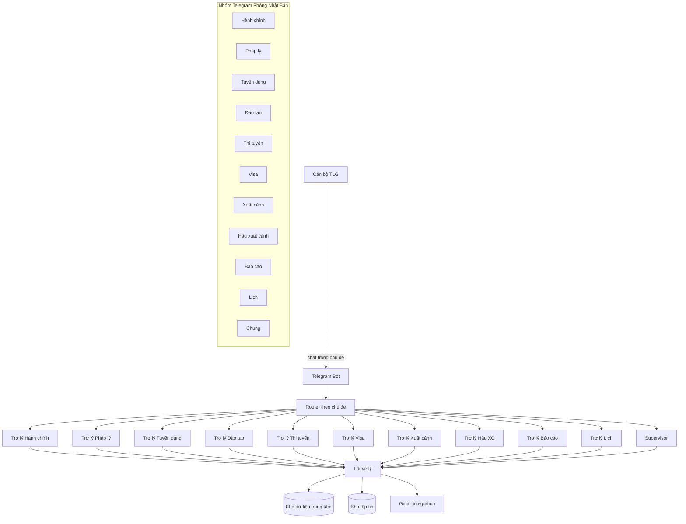
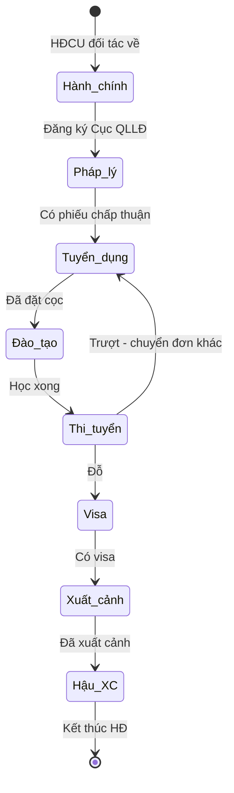
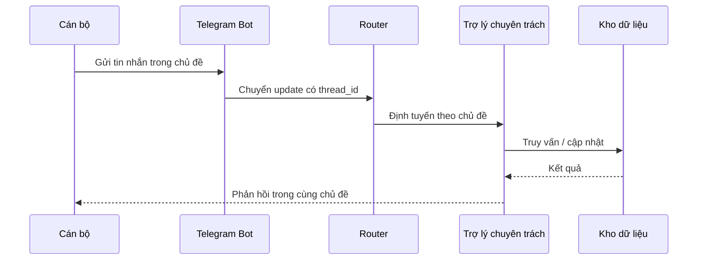
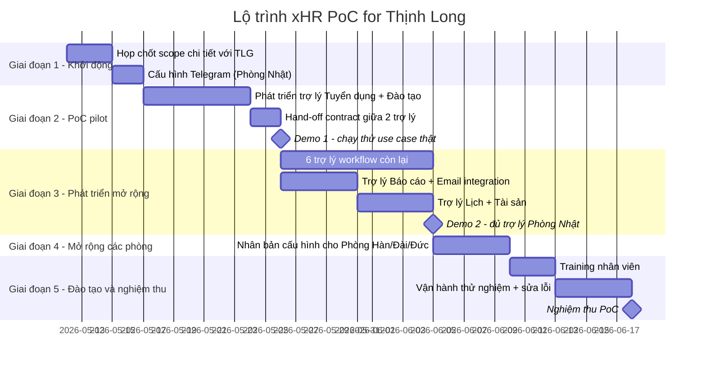

# Solution Proposal — xHR PoC for Thịnh Long

| | |
|---|---|
| **Project** | xHR PoC for Thịnh Long |
| **Document version** | 1.0.2 |
| **Date** | .... |
| **Prepared by** | XOR Cloud |
| **For** | Thịnh Long (TLG) |
| **Status** | Draft for review |
| **Classification** | Confidential — internal use |

### Revision history

| Version | Date | Author | Changes |
|---|---|---|---|
| 1.0.0 | .... | XOR Cloud | Initial draft |
| 1.0.1 | .... | XOR Cloud | Cập nhật sau khảo sát hiện trạng |
| 1.0.2 | .... | XOR Cloud | Điều chỉnh sau buổi họp nhân viên TLG (chuyển hướng multi-agent) |

---

## 1. Tóm tắt cho lãnh đạo (Executive Summary)

Thịnh Long (TLG) đang vận hành quy trình xuất khẩu lao động trên nền dữ liệu phân tán (Excel, email, Zalo, USB), tri thức nghiệp vụ gắn với cá nhân, và phối hợp liên phòng ban ngắt quãng. Hệ quả: tra cứu chậm, báo cáo lên lãnh đạo phải tổng hợp tay, người mới vào không có nguồn học chuẩn.

XOR Cloud đề xuất triển khai nền tảng **xHR — Agentic AI** theo mô hình **multi-agent qua Telegram**: mỗi phòng ban có một nhóm Telegram riêng, trong nhóm chia thành các chủ đề, mỗi chủ đề được vận hành bởi một trợ lý AI chuyên trách. Toàn bộ dữ liệu lưu tập trung một nguồn.

PoC dự kiến **6–8 tuần**, bắt đầu với Phòng Nhật Bản (2 trợ lý: Tuyển dụng + Đào tạo), sau đó mở rộng các trợ lý còn lại và các phòng khác. Tiêu chí nghiệm thu PoC: nhân viên thao tác được không cần XOR Cloud hỗ trợ + 3 phòng ban (Tuyển dụng, Visa, Kế toán) xác nhận khả dụng.

---

## 2. Bối cảnh và hiện trạng (Background)

### 2.1. Về Thịnh Long
Thịnh Long là công ty xuất khẩu lao động (XKLĐ), đưa người Việt sang Nhật Bản, Hàn Quốc, Đài Loan, Đức và các thị trường khác làm việc theo hợp đồng. Hoạt động vận hành chia theo phòng ban thị trường (Phòng Nhật, Phòng Hàn, Phòng Đài...) và phòng chức năng (Tuyển dụng, Đào tạo, Visa, Kế toán, Y tế).

### 2.2. Khảo sát hiện trạng
Sau khảo sát thực tế tại TLG, XOR Cloud xác định **3 nhóm thách thức** chính:

**2.2.1. Dữ liệu phân tán**
Hồ sơ lao động, đơn tuyển, hợp đồng đối tác, giấy tờ scan đang được lưu trên nhiều nguồn không kết nối: máy tính cá nhân, email, Zalo, Google Drive, ổ USB. Khi cần tra cứu, nhân viên phải hỏi trực tiếp người giữ dữ liệu. Không có công cụ tìm kiếm xuyên nguồn.

**2.2.2. Tri thức nghiệp vụ chưa chuẩn hoá**
Kinh nghiệm xử lý quy trình XKLĐ (xử lý visa, làm việc với đối tác Nhật, đào tạo ngôn ngữ...) gắn liền với từng cá nhân nhân viên thâm niên. Không có tài liệu nội bộ chuẩn. Khi nhân viên nghỉ việc, kiến thức đó mất theo. Người mới vào phải mất 2–4 tuần làm quen.

**2.2.3. Phối hợp liên phòng ban chưa thông suốt**
Luồng thông tin giữa các giai đoạn (Tuyển dụng → Đào tạo → Visa → Xuất cảnh → Hậu xuất cảnh) bị ngắt quãng. Báo cáo cho lãnh đạo phải tổng hợp tay từ nhiều nguồn, dẫn đến chậm và thiếu nhất quán.

---

## 3. Mục tiêu dự án (Objectives)

| # | Mục tiêu | Cách đo |
|---|---|---|
| 1 | Hợp nhất dữ liệu phân tán vào một nguồn duy nhất | 100% hồ sơ LĐ + đơn tuyển + hợp đồng phát sinh trong giai đoạn PoC nằm trong hệ thống |
| 2 | Cho phép cán bộ thao tác qua ngôn ngữ tự nhiên tiếng Việt, không cần học phần mềm | ≥ 80% cán bộ trong 3 phòng pilot tự thực hiện ≥ 5 thao tác/ngày sau 2 tuần training |
| 3 | Tự động hoá báo cáo + nhắc nhở giảm thời gian thao tác tay | Báo cáo tuần được sinh tự động (không tổng hợp tay), tỉ lệ đơn quá hạn không ai nhắc giảm > 50% |
| 4 | Xây nền tảng tri thức tổ chức không lệ thuộc cá nhân | Mọi tài liệu upload có metadata + mô tả tự động, tra cứu được bằng câu tự nhiên |
| 5 | Khả năng mở rộng cho các phòng khác sau pilot | Thêm 1 phòng mới chỉ cần ≤ 1 ngày cấu hình |

---

## 4. Phạm vi (Scope)

### 4.1. Trong phạm vi (In scope)

| Hạng mục | Mô tả |
|---|---|
| Multi-agent platform | Triển khai các trợ lý AI chuyên trách theo phòng ban / nghiệp vụ |
| Kênh giao tiếp | Telegram (giai đoạn PoC); mở rộng Zalo/Discord ở giai đoạn sau |
| Quản lý dữ liệu cốt lõi | Lao động, Đơn tuyển, Hợp đồng cung ứng (HĐCU), Hợp đồng lao động, Tệp tin (giấy tờ scan) |
| Workflow quản lý LĐ | Toàn bộ vòng đời từ tiếp nhận YCTD đối tác đến quản lý LĐ tại nước ngoài |
| Báo cáo + nhắc nhở | Báo cáo tuần/tháng tự động, nhắc deadline workflow, lịch nhắc do cán bộ đặt |
| Tích hợp Email | Gửi báo cáo định kỳ qua Gmail cho lãnh đạo chỉ định |
| Phân quyền | Theo vai trò (admin, manager, recruiter, trainer, visa, kế toán, y tế) |
| Training + bàn giao | 1 buổi training/phòng + tài liệu hướng dẫn |

### 4.2. Ngoài phạm vi (Out of scope)

| Hạng mục | Lý do |
|---|---|
| WebApp portal CRUD | Sếp tổng đã quyết định không xây portal; toàn bộ tương tác qua chat |
| Tích hợp ERP / Kế toán bên thứ ba | Chưa xác định hệ thống đích; có thể bổ sung sau PoC |
| Tích hợp Zalo / Discord | Trong lộ trình giai đoạn 2, sau khi Telegram ổn định |
| Mobile app native | Sử dụng Telegram client; không xây app riêng |
| Tự động đặt vé máy bay qua API | Trợ lý ghi nhận thông tin vé; việc đặt vé do nhân viên thực hiện trên web hãng |
| Migration toàn bộ dữ liệu lịch sử | Chỉ import dữ liệu cốt lõi cần thiết cho PoC; migration đầy đủ là dự án riêng |

---

## 5. Giải pháp đề xuất (Proposed Solution)

### 5.1. Tổng quan

Giải pháp xHR dựa trên kiến trúc **multi-agent**:

- Mỗi **phòng ban** (Nhật, Hàn, Đài, Đức...) tương ứng với một **nhóm Telegram** (supergroup ở chế độ Forum)
- Trong mỗi nhóm chia thành các **chủ đề** (topics), mỗi chủ đề là một mảng nghiệp vụ
- Mỗi chủ đề được vận hành bởi một **trợ lý AI chuyên trách** với phạm vi xử lý hẹp, dễ kiểm soát chất lượng
- Tất cả trợ lý truy cập **một kho dữ liệu chung** đảm bảo nhất quán

### 5.2. Nguyên lý hoạt động

Khi cán bộ gửi tin nhắn trong một chủ đề:
1. Hệ thống nhận diện chủ đề
2. Định tuyến yêu cầu đến trợ lý chuyên trách tương ứng
3. Trợ lý thực hiện yêu cầu (tra cứu, tạo bản ghi, sinh báo cáo...)
4. Phản hồi trả về cùng chủ đề
5. Khi cần chuyển sang giai đoạn kế tiếp, trợ lý cập nhật trạng thái và thông báo sang chủ đề liên quan với mention người phụ trách

### 5.3. Lợi ích so với kiến trúc 1-bot

| Tiêu chí | 1-bot | Multi-agent |
|---|---|---|
| Phạm vi xử lý | Toàn bộ nghiệp vụ trong 1 prompt | Mỗi trợ lý xử lý 1 mảng — chính xác hơn |
| Hiệu năng | Phải duyệt 40+ tool mỗi request | 5–10 tool/trợ lý — nhanh hơn |
| Phân quyền | Phải mô phỏng trong prompt | Tự nhiên qua quyền chủ đề Telegram |
| Trải nghiệm người dùng | Cần học cú pháp | Vào đúng chủ đề là vào đúng vai trò |
| Khả năng mở rộng | Sửa 1 chỗ ảnh hưởng toàn bộ | Thêm trợ lý mới không ảnh hưởng cái khác |

---

## 6. Yêu cầu chức năng (Functional Requirements)

### 6.1. Workflow Agents (theo vòng đời 1 đơn / 1 lao động)

| ID | Trợ lý | Trách nhiệm chính |
|---|---|---|
| FA-01 | Hành chính | Tiếp nhận và lưu trữ Hợp đồng Cung ứng (HĐCU) với đối tác |
| FA-02 | Pháp lý | Đăng ký đơn với Cục Quản lý lao động Ngoài nước; theo dõi phiếu trả lời |
| FA-03 | Tuyển dụng | Tạo hồ sơ LĐ, ghi nhận trạng thái (đang tìm hiểu / đồng ý tham gia / đang khám SK / đã đặt cọc / đang đào tạo) |
| FA-04 | Đào tạo | Phân lớp, theo dõi tiến độ học, ghi nhận đánh giá |
| FA-05 | Thi tuyển | Ghi nhận kết quả thi tuyển (đỗ / trượt + lý do) |
| FA-06 | Visa | Hỗ trợ sinh form xin visa, quản lý hồ sơ LĐ phục vụ visa |
| FA-07 | Xuất cảnh | Ghi nhận vé máy bay, lịch bay, nhắc chuẩn bị |
| FA-08 | Hậu xuất cảnh | Theo dõi LĐ tại nước ngoài, ghi nhận sự cố nếu có |

### 6.2. Support Agents (xuyên suốt)

| ID | Trợ lý | Trách nhiệm chính |
|---|---|---|
| SA-01 | Báo cáo | Sinh báo cáo tuần / tháng tự động, xuất Excel / CSV / PDF theo yêu cầu, gửi email cho lãnh đạo |
| SA-02 | Lịch | Quản lý lịch họp, lịch hẹn phỏng vấn |
| SA-03 | Tài sản | Quản lý tài sản công ty (laptop, xe, văn phòng phẩm...) |
| SA-04 | Supervisor | Trực topic "Chung", tiếp nhận yêu cầu chưa rõ thuộc chủ đề nào, định tuyến |

### 6.3. Nhóm chức năng xuyên suốt

| ID | Chức năng | Mô tả |
|---|---|---|
| FN-01 | Hỏi-đáp tiếng Việt | Cán bộ tra cứu dữ liệu bằng câu tự nhiên |
| FN-02 | Phân tích tài liệu | Trợ lý đọc PDF, Word, ảnh, scan; trích xuất thông tin có cấu trúc |
| FN-03 | Xuất file | Excel (.xlsx), CSV, Markdown, JSON |
| FN-04 | Nhắc nhở | Tự động theo workflow + tự do theo yêu cầu cán bộ |
| FN-05 | Tag người trong nhóm | Khi nhắc nhở trong group, tự động @mention người phụ trách |
| FN-06 | Hand-off giữa trợ lý | Tự thông báo sang chủ đề kế khi hoàn thành giai đoạn |
| FN-07 | Phân quyền theo vai trò | 7 vai trò có quyền đọc/ghi khác nhau |
| FN-08 | Audit log | Ghi lại mọi thao tác của trợ lý vào DB |

---

## 7. Yêu cầu phi chức năng (Non-Functional Requirements)

| ID | Hạng mục | Yêu cầu |
|---|---|---|
| NFR-01 | Hiệu năng | Phản hồi đơn giản ≤ 15s; phản hồi cần xử lý tài liệu ≤ 90s |
| NFR-02 | Khả dụng | Uptime ≥ 99% trong giờ làm việc |
| NFR-03 | Khả năng mở rộng | Thêm 1 phòng mới ≤ 1 ngày cấu hình |
| NFR-04 | Bảo mật dữ liệu | Mã hoá truyền (TLS), dữ liệu lưu tại server có phân quyền |
| NFR-05 | Bảo mật quyền | Mỗi tài khoản có vai trò; mọi truy cập đi qua kiểm tra quyền |
| NFR-06 | Audit | Mọi thao tác sửa đổi dữ liệu được log với timestamp + actor |
| NFR-07 | Backup | Dữ liệu DB được backup hàng ngày, lưu giữ 30 ngày |
| NFR-08 | Đa ngôn ngữ tài liệu | Đọc và tóm tắt được tiếng Việt, Nhật, Hàn, Trung, Anh |
| NFR-09 | Khả năng audit thao tác AI | Mọi quyết định của trợ lý đều có log lý do (input → tool gọi → output) |

---

## 8. Kiến trúc giải pháp (Solution Architecture)

### 8.1. Sơ đồ tổng quan



### 8.2. Luồng hand-off giữa các trợ lý



### 8.3. Luồng xử lý 1 yêu cầu



---

## 9. Sản phẩm bàn giao (Deliverables)

| # | Hạng mục | Mô tả |
|---|---|---|
| D-01 | Hệ thống chạy thực tế | Multi-agent platform deployed, vận hành Phòng Nhật Bản |
| D-02 | Bộ trợ lý theo phòng | 11 trợ lý chuyên trách (8 workflow + 3 support) cho Phòng Nhật Bản; mở rộng các phòng khác |
| D-03 | Cấu hình Telegram | Supergroup + chủ đề + phân quyền theo template chuẩn |
| D-04 | Tích hợp Email | Gmail integration gửi báo cáo cho lãnh đạo chỉ định |
| D-05 | Tài liệu vận hành | Hướng dẫn sử dụng cho cán bộ (PDF + video) |
| D-06 | Tài liệu kỹ thuật | Architecture document, API spec, runbook |
| D-07 | Training | 1 buổi training/phòng (offline hoặc online) |
| D-08 | Source code | Toàn bộ source code đặt tại repo Git, bàn giao quyền truy cập |
| D-09 | Báo cáo PoC | Đánh giá kết quả PoC, metric thực tế, đề xuất giai đoạn kế |

---

## 10. Lộ trình và mốc nghiệm thu (Timeline & Milestones)

### 10.1. Tổng thể



### 10.2. Bảng mốc

| Mốc | Mô tả | Tiêu chí pass |
|---|---|---|
| M1 | Chốt scope | TLG ký xác nhận danh sách trợ lý + cấu trúc chủ đề |
| M2 | Demo 1 | Tạo được 1 LĐ qua flow Tuyển dụng → Đào tạo, hand-off thành công |
| M3 | Demo 2 | Đủ 11 trợ lý Phòng Nhật, chạy use case end-to-end |
| M4 | Sẵn sàng nghiệm thu | Các phòng pilot đã có đủ trợ lý + training xong |
| M5 | Nghiệm thu PoC | Đạt 100% Acceptance Criteria (mục 14) |

---

## 11. Vai trò và trách nhiệm (Roles & Responsibilities)

### 11.1. RACI matrix

| Hạng mục | XOR Cloud (PM) | XOR Cloud (Dev) | TLG (Sếp tổng) | TLG (Đầu mối) | TLG (Cán bộ) |
|---|---|---|---|---|---|
| Định hướng nghiệp vụ | C | I | **A** | R | C |
| Phát triển phần mềm | **A** | R | I | C | I |
| Cấu hình Telegram | R | R | I | **A** | I |
| Cung cấp dữ liệu mẫu | I | C | I | **A** | R |
| Test thực tế | C | C | I | **A** | R |
| Training | R | C | I | **A** | R |
| Nghiệm thu | I | I | **A** | R | C |

(R = Responsible, A = Accountable, C = Consulted, I = Informed)

### 11.2. Người đầu mối hai bên

| Vai trò | Bên | Người |
|---|---|---|
| Project Manager (PM) | XOR Cloud | .... |
| Tech Lead | XOR Cloud | .... |
| Sponsor | TLG | .... |
| Business Owner | TLG | .... |
| Đầu mối nghiệp vụ | TLG | .... |

---

## 12. Giả định và ràng buộc (Assumptions & Constraints)

### 12.1. Giả định

| # | Giả định |
|---|---|
| AS-01 | TLG đảm bảo có hạ tầng mạng internet ổn định cho nhân viên truy cập Telegram |
| AS-02 | TLG cung cấp đủ tài khoản Telegram cho nhân viên tham gia PoC |
| AS-03 | TLG cung cấp dữ liệu mẫu (YCTD, hợp đồng, hồ sơ LĐ) trong tuần đầu |
| AS-04 | TLG cử đủ 1 đầu mối làm việc với XOR Cloud trong suốt PoC |
| AS-05 | Số lượng LĐ phát sinh trong giai đoạn PoC ≤ 500 hồ sơ |

### 12.2. Ràng buộc

| # | Ràng buộc |
|---|---|
| CN-01 | Không xây WebApp portal — toàn bộ tương tác qua chat (theo quyết định Sếp tổng) |
| CN-02 | Không tích hợp với hệ thống ERP / Kế toán bên thứ ba trong giai đoạn PoC |
| CN-03 | Server đặt tại hạ tầng do XOR Cloud cung cấp trong giai đoạn PoC |
| CN-04 | Sử dụng Claude làm LLM trong giai đoạn PoC; mở rộng / thay thế ở giai đoạn Production |
| CN-05 | PoC hoàn thành trong tối đa 8 tuần kể từ ngày khởi động |

---

## 13. Rủi ro và biện pháp giảm thiểu (Risks & Mitigations)

| ID | Rủi ro | Khả năng xảy ra | Tác động | Biện pháp giảm thiểu |
|---|---|---|---|---|
| R-01 | Cán bộ không quen chat với trợ lý, từ chối sử dụng | Trung bình | Cao | Training kỹ + đầu mối hỗ trợ tại chỗ trong tuần đầu |
| R-02 | Form dài (20+ trường) chậm qua chat | Cao | Trung bình | Bridge với Google Form hoặc upload file template, trợ lý tự parse |
| R-03 | Trợ lý sai validation (CCCD, ngày tháng...) | Trung bình | Cao | Schema validation backend; trợ lý confirm với cán bộ trước khi lưu |
| R-04 | Mất kết nối Telegram / lỗi rate-limit | Thấp | Trung bình | Queue + retry sẵn trong hệ thống |
| R-05 | Chi phí LLM cao khi scale | Trung bình | Trung bình | Lộ trình giai đoạn 2: tự host LLM nội bộ thay Claude |
| R-06 | TLG thay đổi yêu cầu giữa chừng | Cao | Trung bình | Process change request rõ ràng; tác động chi phí + lịch được đánh giá trước khi chấp nhận |
| R-07 | Hand-off lỗi, LĐ kẹt giữa 2 giai đoạn | Trung bình | Trung bình | Cron quét hằng ngày phát hiện LĐ ì + DM admin |
| R-08 | Lộ lọt dữ liệu qua Telegram | Thấp | Cao | File quan trọng lưu cloud riêng, Telegram chỉ giữ link reference; phân quyền chủ đề |

---

## 14. Tiêu chí nghiệm thu (Acceptance Criteria)

PoC được đánh giá pass khi **tất cả** tiêu chí dưới đây đạt:

| # | Tiêu chí | Cách kiểm chứng |
|---|---|---|
| AC-01 | 11 trợ lý Phòng Nhật vận hành ổn định | Test 3 ngày liên tiếp không downtime > 30 phút/ngày |
| AC-02 | Cán bộ tạo được hồ sơ LĐ qua chat trong < 3 phút | Test với 5 cán bộ, đo thời gian thực tế |
| AC-03 | Hand-off giữa Tuyển dụng → Đào tạo → Thi tuyển → Visa hoạt động | Theo dõi 5 LĐ qua đủ flow |
| AC-04 | Báo cáo tuần được gửi tự động cho lãnh đạo qua Telegram + Email | 2 tuần liên tiếp gửi đúng thứ Sáu 17h |
| AC-05 | Trợ lý đọc và trích xuất được YCTD đối tác chính xác ≥ 85% trường | Test với 10 file YCTD thực tế |
| AC-06 | Tra cứu file qua câu tự nhiên trả kết quả đúng ≥ 80% | Test 20 câu truy vấn |
| AC-07 | 3 phòng pilot (Tuyển dụng, Visa, Kế toán) xác nhận khả dụng | Phỏng vấn cán bộ + ký xác nhận |
| AC-08 | Có đủ tài liệu bàn giao (D-05, D-06) | Review checklist tài liệu |

---

## 15. Điều khoản thương mại (Commercial Terms)

(Thông tin chi phí, payment schedule, SLA chính thức được trình bày trong tài liệu riêng — **xHR Commercial Proposal v1.0**)

---

## 16. Bảng thuật ngữ (Glossary)

| Thuật ngữ | Định nghĩa |
|---|---|
| Agent / Trợ lý ảo | Module AI chuyên trách một mảng nghiệp vụ, vận hành 1 chủ đề Telegram |
| Hand-off | Việc chuyển trách nhiệm xử lý 1 hồ sơ LĐ từ trợ lý này sang trợ lý kế |
| HĐCU | Hợp đồng cung ứng — ký giữa công ty XKLĐ và đối tác (xí nghiệp) |
| Multi-agent | Kiến trúc nhiều trợ lý phối hợp, mỗi trợ lý có phạm vi hẹp |
| PoC | Proof of Concept — giai đoạn chứng minh tính khả thi |
| RACI | Ma trận trách nhiệm: Responsible / Accountable / Consulted / Informed |
| SLA | Service Level Agreement — cam kết mức độ dịch vụ |
| Supergroup | Loại nhóm Telegram có sức chứa lớn, hỗ trợ chủ đề (topics) |
| Topic / Chủ đề | Tính năng phân ngăn trong nhóm Telegram supergroup |
| Workflow stage (W1–W8) | Các bước trong vòng đời xử lý 1 đơn tuyển XKLĐ |
| XKLĐ | Xuất khẩu lao động |
| YCTD | Yêu cầu tuyển dụng — văn bản đối tác gửi mô tả nhu cầu nhân lực |

---

## 17. Phụ lục (Appendix)

### Appendix A — Cấu trúc chủ đề chuẩn cho 1 phòng

```
Chung
Hành chính
Pháp lý
Tuyển dụng
Đào tạo
Thi tuyển
Visa
Xuất cảnh
LĐ tại nước ngoài
Báo cáo
Lịch
```

Tổng: 11 chủ đề/phòng. Có thể bổ sung tuỳ phòng (vd Phòng Đức thêm chủ đề "Chứng chỉ y tá").

### Appendix B — Tài liệu tham khảo

- xHR Architecture Document (technical, dành cho team kỹ thuật TLG)
- xHR Operation Manual (sổ tay vận hành cán bộ)
- xHR Commercial Proposal v1.0 (điều khoản thương mại)

### Appendix C — Liên hệ XOR Cloud

| Vai trò | Người | Liên hệ |
|---|---|---|
| Project Manager | .... | .... |
| Tech Lead | .... | .... |
| Hỗ trợ vận hành | .... | .... |

---

**END OF DOCUMENT**
