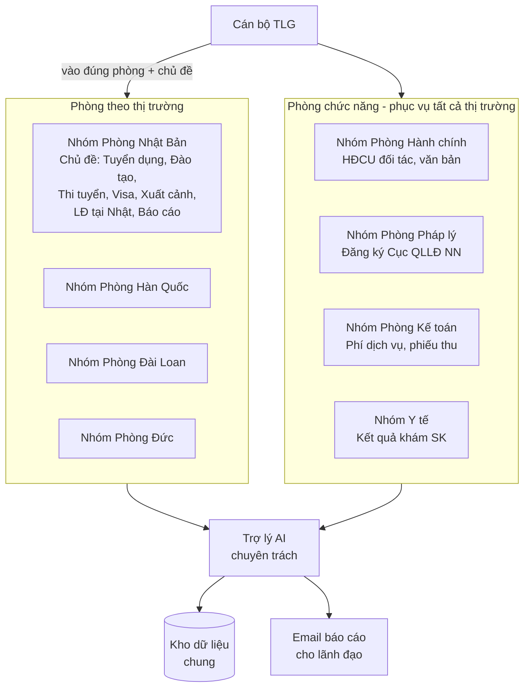
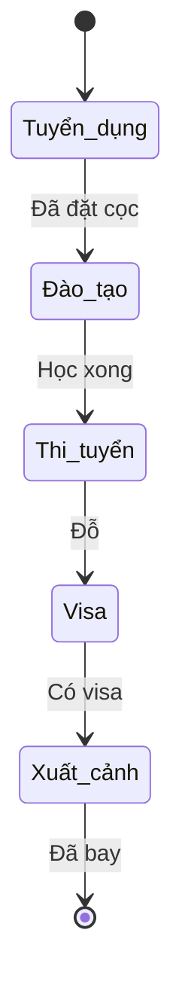
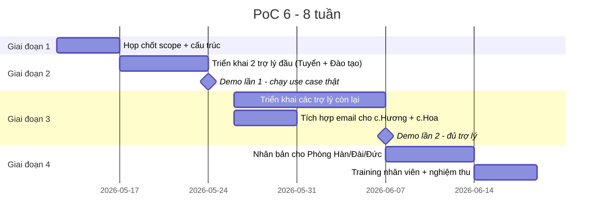

# Đề xuất Giải pháp xHR

**Trình bày bởi XOR Cloud · Gửi tới: Ban lãnh đạo Thịnh Long**
**Phiên bản 1.0.2 · Ngày: ....**

---

## 1. Mục tiêu

| # | Mục tiêu | Chỉ số đo |
|---|---|---|
| 1 | **Hợp nhất dữ liệu** XKLĐ về một nguồn duy nhất | 100% hồ sơ LĐ, đơn tuyển, HĐCU, hợp đồng phát sinh trong giai đoạn PoC được lưu trong hệ thống |
| 2 | **Tự động hoá báo cáo + nhắc nhở** liên phòng ban | Báo cáo tuần sinh tự động (không tổng hợp tay); đơn quá hạn được nhắc 100% |
| 3 | **Đơn giản hoá truy cập** dữ liệu cho cán bộ | Cán bộ thao tác bằng tiếng Việt tự nhiên qua Telegram, không cần học phần mềm |
| 4 | **Chuẩn hoá quy trình** trên toàn công ty | Tất cả phòng ban dùng cùng một flow xử lý, không lệ thuộc kinh nghiệm cá nhân |
| 5 | **Xây nền tảng tri thức** dùng chung | Mọi tài liệu upload có metadata + mô tả tự động, tra cứu được bằng câu tự nhiên |
| 6 | **Khả năng mở rộng** dễ dàng | Thêm 1 phòng ban mới ≤ 1 ngày cấu hình |

---

## 2. Giải pháp đề xuất

### 2.1. Ý tưởng cốt lõi

> **Mỗi phòng ban có 1 nhóm Telegram. Trong nhóm chia thành chủ đề. Mỗi chủ đề có 1 trợ lý ảo chuyên môn.**

Nhân viên cứ vào đúng chủ đề rồi nói chuyện. Trợ lý xử lý, lưu vào kho chung, chuyển sang chủ đề kế khi xong giai đoạn.

### 2.2. Sơ đồ tổng

TLG có 2 loại phòng — mỗi phòng là 1 nhóm Telegram riêng, ngang cấp nhau:

**Quan trọng:** Phòng Hành chính, Pháp lý, Kế toán, Y tế **ngang cấp** với Phòng Nhật / Hàn / Đài / Đức — mỗi phòng có nhóm Telegram riêng. Khi cần phối hợp (vd HĐCU mới về cho thị trường Nhật), trợ lý tự thông báo qua lại giữa các nhóm + tag người phụ trách.

### 2.3. Trợ lý làm gì giúp nhân viên

**Mỗi trợ lý như một thư ký riêng cho 1 mảng việc:**

| Trợ lý | Việc làm hộ | Cán bộ nói gì |
|---|---|---|
| Hành chính | Lưu HĐCU đối tác, văn bản pháp lý | "Lưu HĐCU mới với Toyota" |
| Tuyển dụng | Tạo hồ sơ LĐ, ghi nhận trạng thái, đặt cọc | "Tạo hồ sơ Nguyễn Văn A, 1998, Nghệ An" |
| Đào tạo | Phân lớp, theo dõi tiến độ, đánh giá | "Xếp LD-001 vào lớp N4 tháng 5" |
| Thi tuyển | Ghi kết quả đỗ/trượt + lý do | "Kết quả LD-001: đỗ 82 điểm" |
| Visa | Sinh form xin visa, quản lý hồ sơ | "Làm visa cho LD-001 đi Nhật" |
| Xuất cảnh | Ghi nhận vé, lịch bay, nhắc chuẩn bị | "Vé LD-001 ngày 15/8" |
| Báo cáo | Tổng hợp, xuất Excel, gửi email | "Xuất danh sách LĐ training tháng 5" |

Trợ lý **không thay thế nhân viên**. Việc cần con người (đàm phán đối tác, chăm sóc LĐ, quyết định lớn) vẫn do nhân viên làm. Trợ lý làm phần **lặt vặt, lặp lại, dễ quên**.

### 2.4. Tự động chuyển giao giữa các giai đoạn

Khi LĐ qua xong 1 giai đoạn, trợ lý tự thông báo sang chủ đề kế:

Không ai phải nhớ "đến lượt Đào tạo nhận LĐ này" — trợ lý tự nhắc kèm @mention người phụ trách.

### 2.5. Báo cáo và nhắc nhở tự động

- **Mỗi sáng 8h**: trợ lý gửi email cho chị Hương + chị Hoa — việc trong ngày, đơn ì cần xử lý
- **Mỗi chiều 17h**: tóm tắt việc đã làm
- **Thứ Sáu 17h**: báo cáo tuần cho sếp tổng (Telegram + email)
- **Lúc nào cũng được**: cán bộ tự đặt nhắc — "9h mai nhắc tôi gọi Toyota", "thứ 6 14h nhắc cả nhóm họp"

---

## 3. Lộ trình triển khai

### Sản phẩm bàn giao cuối PoC

- Hệ thống chạy thực tế cho Phòng Nhật và các phòng khác (tuỳ scope chốt)
- 11 trợ lý chuyên trách cho mỗi phòng
- Tích hợp email tự động cho lãnh đạo chỉ định
- Tài liệu hướng dẫn sử dụng cho cán bộ
- Training 1 buổi/phòng

---

