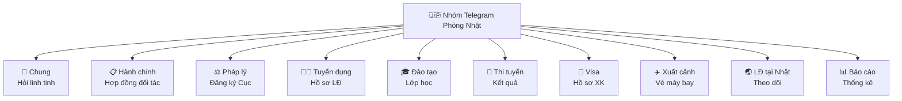
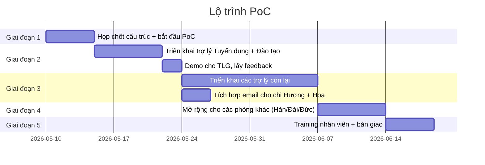

# Đề xuất xHR cho Thịnh Long — Phiên bản tóm tắt cho lãnh đạo

> Bản trình bày phương án giải pháp — viết cho lãnh đạo và nhân viên không chuyên về công nghệ. Mọi thuật ngữ kỹ thuật đã được lược bỏ.

---

## 1. Hiện tại Thịnh Long đang gặp gì

Sau khảo sát thực tế công việc tại TLG, chúng tôi thấy có **3 vướng mắc lớn**:

### Vướng mắc 1 — Thông tin nằm rải rác
Hồ sơ lao động, đơn tuyển, hợp đồng đối tác, giấy tờ scan... đang lưu ở nhiều nơi: máy cá nhân, email, Zalo, Excel, USB. Khi cần tra cứu phải đi hỏi từng người, mất thời gian, dễ thất lạc.

### Vướng mắc 2 — Kinh nghiệm gắn liền với cá nhân
Mỗi nhân viên có cách làm riêng, kinh nghiệm chỉ trong đầu họ. Người mới vào phải học từ đầu, không có tài liệu chuẩn. Khi 1 người nghỉ, công ty mất luôn kiến thức đó.

### Vướng mắc 3 — Phòng ban chưa kết nối thông suốt
Tuyển dụng xong không tự động báo cho Đào tạo. Đào tạo xong không báo Visa. Báo cáo cho sếp phải tổng hợp tay từ nhiều nguồn — chậm và dễ sai.

---

## 2. Giải pháp đề xuất

Thay vì xây 1 phần mềm khổng lồ buộc nhân viên phải học, chúng tôi đề xuất:

> **Mỗi phòng ban có riêng 1 "trợ lý ảo" — nói chuyện qua Telegram như chat với đồng nghiệp.**

Cụ thể:
- 1 phòng ban (Nhật / Hàn / Đài / Đức...) = 1 nhóm Telegram riêng
- Trong nhóm chia ra các **chủ đề** (như các cánh ngăn): Tuyển dụng, Đào tạo, Visa, Báo cáo...
- Mỗi chủ đề có **1 trợ lý ảo chuyên môn riêng** — chỉ giỏi mảng đó
- Tất cả trợ lý cùng dùng **1 kho dữ liệu chung** → thay đổi ở chỗ nào ai cũng thấy

Nhân viên không cần học phần mềm — cứ vào đúng chủ đề rồi nói chuyện bằng tiếng Việt tự nhiên.

---

## 3. "Trợ lý ảo" là gì?

Hình dung mỗi trợ lý ảo như **một thư ký riêng** cho 1 mảng việc:

| Trợ lý | Việc làm hộ bạn | Bạn nói gì với nó |
|---|---|---|
| 🧑‍💼 **Trợ lý Tuyển dụng** | Tạo hồ sơ lao động, ghi nhận đặt cọc | "Tạo hồ sơ Nguyễn Văn A, 1998, Nghệ An" |
| 🎓 **Trợ lý Đào tạo** | Phân lớp học, theo dõi tiến độ | "Xếp LD-001 vào lớp N4 tháng 5" |
| 🛂 **Trợ lý Visa** | Chuẩn bị hồ sơ visa | "Làm visa cho LD-001 đi Nhật" |
| 📊 **Trợ lý Báo cáo** | Tổng hợp số liệu, xuất Excel | "Xuất danh sách LĐ đang training tháng 5" |
| 📅 **Trợ lý Lịch** | Quản lý lịch họp, lịch hẹn | "Đặt lịch họp với Toyota thứ 5 14h" |

Trợ lý **không thay thế nhân viên** — nó **làm hộ những việc lặt vặt** (nhập liệu, tổng hợp, nhắc nhở) để nhân viên tập trung vào việc cần con người (quyết định, đàm phán, chăm sóc LĐ).

---

## 4. Một phòng nhìn như thế nào

Ví dụ Phòng Nhật Bản:

Cán bộ tuyển dụng chỉ cần vào ngăn **🧑‍💼 Tuyển dụng** → nói chuyện với trợ lý chuyên về tuyển dụng. Cán bộ visa vào ngăn **🛂 Visa**. Không phải nhớ "phải gõ lệnh gì".

Các phòng khác (Hàn / Đài / Đức) đều có cấu trúc giống vậy.

---

## 5. Lợi ích cụ thể

### A. Cho nhân viên
- **Không phải học phần mềm mới** — chỉ cần biết dùng Telegram (đã quen)
- **Làm việc nhanh hơn** — nói 1 câu thay vì điền form 20 trường
- **Có thể làm trên điện thoại** — không cần ngồi máy tính
- **Không lo nhập sai** — trợ lý hỏi lại nếu thiếu / sai

### B. Cho lãnh đạo
- **Nhìn thấy mọi việc đang chạy** — vào nhóm Telegram thấy hết
- **Báo cáo tự động cuối tuần** — không phải nhắc nhân viên gửi
- **Biết phòng nào đang ì ở đâu** — trợ lý báo cáo tự nhắc
- **Email hằng ngày** cho chị Hương + chị Hoa với tổng hợp việc

### C. Cho công ty
- **Kiến thức tích luỹ vào hệ thống** — không lệ thuộc cá nhân ai
- **Người mới vào dùng được ngay** — không cần training nhiều
- **Mở rộng dễ** — thêm phòng = thêm 1 nhóm Telegram
- **Tra cứu lịch sử nhanh** — "có hợp đồng nào với Toyota tháng 3?" → tìm ra ngay

---

## 6. Một ngày làm việc thực tế

Để hình dung, đây là **1 use case thật**:

### 9:00 — Cán bộ tuyển dụng tạo hồ sơ LĐ mới
> 👤 "Tạo hồ sơ Nguyễn Văn A, 1998, quê Nghệ An, chưa biết tiếng Nhật"

> 🤖 "✅ Đã tạo LD-00045. Anh đặt cọc bao nhiêu cho LĐ này?"

> 👤 "5 triệu"

> 🤖 "Đã ghi nhận. Em tự báo cho bên Đào tạo xếp lớp N4 tháng 5"

### 9:15 — Đào tạo nhận thông báo
Trong ngăn **🎓 Đào tạo** xuất hiện:
> 🤖 "@cô_Hà LD-00045 sẵn sàng nhập lớp N4 tháng 5"

Cô Hà chỉ cần "OK xếp vào lớp N4-T5" → trợ lý ghi nhận.

### 14:30 — Sếp tổng muốn xem tình hình
Sếp vào ngăn **📊 Báo cáo**:
> 👤 "Bao nhiêu LĐ đang training tháng này?"

> 🤖 "Hiện 87 LĐ đang training, chia 4 lớp:
>   • Lớp N4 tháng 5: 23 LĐ
>   • Lớp N4 tháng 6: 31 LĐ
>   • Lớp Hàn TOPIK 3: 18 LĐ
>   • Lớp Đức B1: 15 LĐ"

### 17:00 — Cuối ngày trợ lý gửi email cho chị Hương + chị Hoa
Email tự động vào hộp thư:
> **Tổng kết ngày 15/05/2026**
>
> - Hồ sơ mới: 3 LĐ
> - Đỗ thi tuyển: 5
> - Visa cấp: 2
> - Đơn ì cần lưu ý: XHR-12 (W3 — 8 ngày)

### Thứ Sáu 17:00 — Báo cáo tuần tự động
Sếp tổng nhận DM Telegram + email tóm tắt cả tuần.

---

## 7. So sánh với cách hiện tại

| Cách làm | Hiện tại | Sau khi có xHR |
|---|---|---|
| Tạo 1 hồ sơ LĐ | Mở Excel, gõ tay 20 trường | Chat 5-7 câu, trợ lý tự làm |
| Tìm "hợp đồng Toyota tháng 3" | Lục email, lục folder | Hỏi 1 câu, ra ngay |
| Báo cáo tuần | 2 nhân viên tổng hợp tay 4-5 tiếng | Tự động — sếp nhận trên Telegram + email |
| Nhắc cán bộ "đơn XHR-12 quá hạn rồi" | Sếp tự nhớ + tự nhắn | Hệ thống tự nhắn người phụ trách |
| Người mới vào | Đào tạo 2 tuần | Đào tạo 2 ngày — phần còn lại tự chat trợ lý |

---

## 8. Lộ trình triển khai

**Tổng thời gian PoC: ~6-8 tuần** (tuỳ feedback từng giai đoạn).

---

## 9. TLG cần chuẩn bị gì

Để triển khai thuận lợi, TLG cần:

| Việc | Người phụ trách | Khi nào |
|---|---|---|
| Liệt kê các phòng ban + chủ đề trong mỗi phòng | Sếp tổng + Quản lý các phòng | Tuần 1 |
| Cử 1-2 nhân viên đầu mối làm việc với XOR Cloud | Bộ phận HC | Tuần 1 |
| Cung cấp file mẫu (YCTD, hợp đồng, form...) | Mỗi phòng | Tuần 1 |
| List nhân viên + vai trò để cấu hình phân quyền | Bộ phận HC | Tuần 2 |
| Cử người test thực tế khi demo | 1 cán bộ / phòng | Tuần 3 trở đi |
| Email chị Hương + chị Hoa để nhận báo cáo | (đã có) | Tuần 4 |

---

## 10. Câu hỏi thường gặp

### Q: Nhân viên có cần học gì không?
**A:** Cần biết dùng Telegram (đa số đã biết). Còn cách chat với trợ lý là **tiếng Việt tự nhiên** — như nhắn cho đồng nghiệp. XOR Cloud sẽ training 1 buổi cho mỗi phòng.

### Q: Nếu chat không hiểu, hỏi gì cũng được không?
**A:** Có. Trợ lý hỏi lại nếu chưa rõ. Không trả lời được thì nó nói thẳng và chuyển sang trợ lý khác hoặc nhờ admin.

### Q: Lỡ trợ lý làm sai thì sao?
**A:** Trợ lý **luôn hỏi xác nhận trước khi thực hiện** việc quan trọng (tạo hồ sơ, sửa hợp đồng, xoá). Nếu sai, có lịch sử để kiểm tra + sửa lại. Nó **không tự duyệt phí trên 50 triệu** — luôn cần lãnh đạo OK.

### Q: Trợ lý có thay thế nhân viên không?
**A:** Không. Trợ lý làm việc lặt vặt (nhập liệu, tổng hợp, nhắc nhở). Việc cần con người (quyết định, đàm phán, chăm sóc LĐ) vẫn do nhân viên làm. Mục tiêu là **giúp nhân viên đỡ tay** chứ không thay người.

### Q: Dữ liệu có an toàn không?
**A:** Có. Dữ liệu lưu trên server riêng. File quan trọng (hộ chiếu, hợp đồng) lưu trên cloud riêng của công ty, **không trên Telegram**. Phân quyền theo vai trò — kế toán không xem được hồ sơ tuyển, recruiter không sửa được hợp đồng đã ký.

### Q: Mất internet thì sao?
**A:** Dữ liệu vẫn an toàn. Khi có mạng lại, hệ thống chạy tiếp bình thường. Không mất gì.

### Q: Có thể dùng trên điện thoại không?
**A:** Có. Telegram dùng tốt trên mọi điện thoại. Sếp ngồi café vẫn tra cứu được.

### Q: Chi phí vận hành?
**A:** Sẽ trao đổi cụ thể với sếp tổng theo scale (số phòng, số LĐ, lượng dùng/tháng).

### Q: Nếu sau này muốn dừng thì sao?
**A:** Dữ liệu là của TLG, xuất ra Excel bất cứ lúc nào. Không khoá vendor.

### Q: Có hỗ trợ Zalo, Discord không?
**A:** Hiện tại Telegram. Zalo và Discord trong lộ trình giai đoạn 2 (sau khi Telegram chạy ổn).

---

## 11. Cam kết của XOR Cloud

1. **Training nhân viên** — 1 buổi cho mỗi phòng, có tài liệu hướng dẫn
2. **Hỗ trợ vận hành 24/7** trong giai đoạn PoC + 3 tháng đầu Production
3. **Sửa lỗi miễn phí** trong giai đoạn PoC + 6 tháng đầu Production
4. **Bàn giao đầy đủ** dữ liệu + tài liệu nếu TLG muốn tự vận hành sau này
5. **Báo cáo định kỳ** tiến độ + sử dụng cho lãnh đạo TLG

---

## 12. Bước tiếp theo

1. **Họp chốt scope** với sếp tổng — cấu trúc các phòng, chủ đề cụ thể
2. **Bắt đầu triển khai** Phòng Nhật làm mẫu
3. **Demo sau 2 tuần** — chạy thử use case thực tế
4. **Đánh giá** rồi mở rộng các phòng còn lại

---

**Liên hệ:** XOR Cloud — đầu mối triển khai
**Tài liệu liên quan:** Bản chi tiết kỹ thuật có sẵn cho team IT của TLG khi cần
