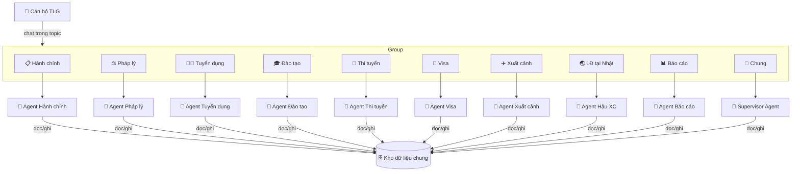
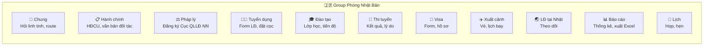
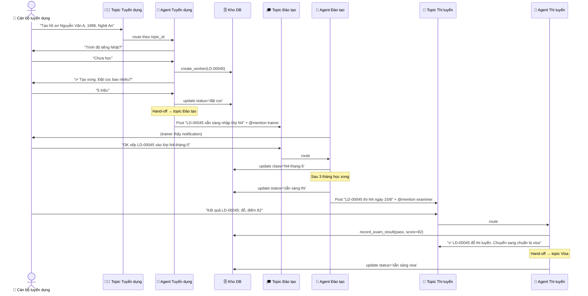
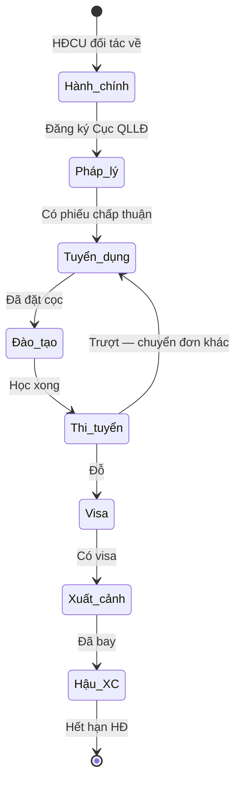
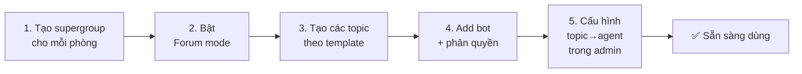
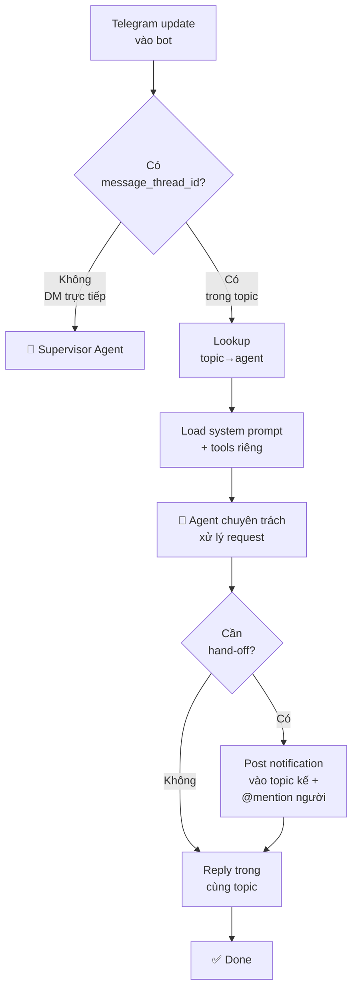
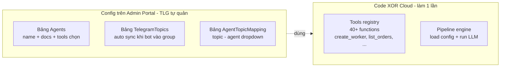
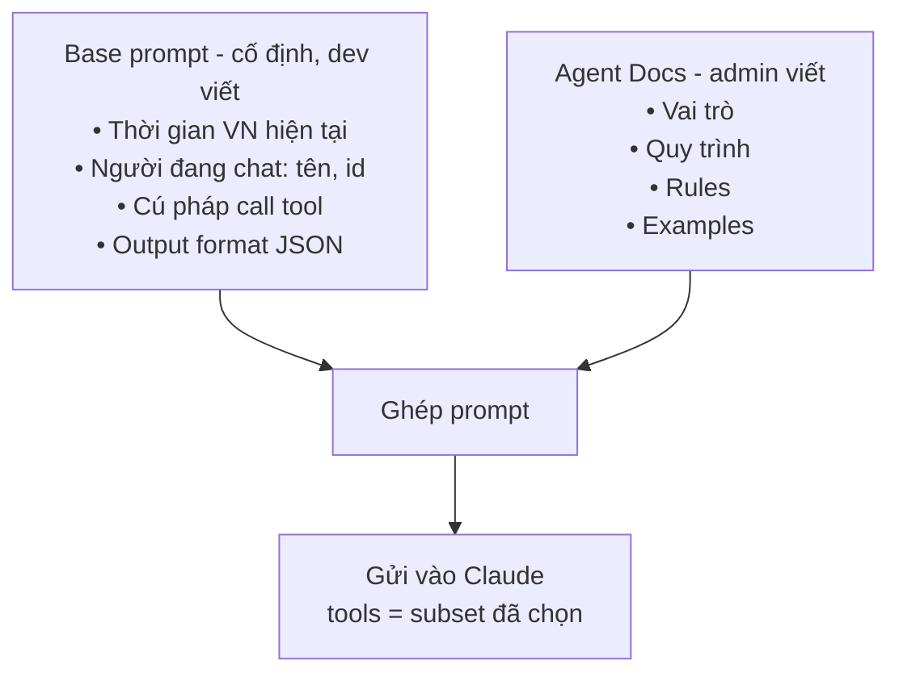
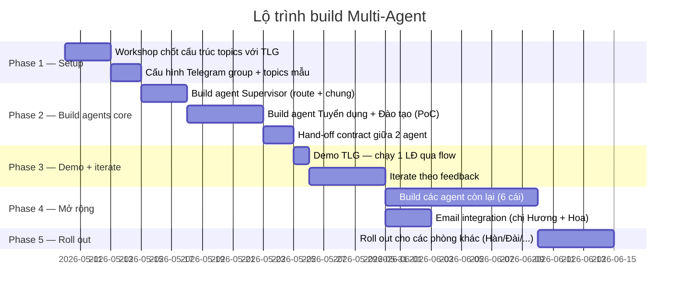

# Phương án Multi-Agent cho xHR

> Đề xuất chuyển từ kiến trúc "1 bot 1 agent" sang **multi-agent theo topic Telegram**: mỗi phòng ban có 1 group Telegram, mỗi group có nhiều topic, mỗi topic 1 AI agent chuyên trách.

---

## 1. Flow chính khi dùng multi-agent



**Ý chính:**
- 1 phòng = 1 group Telegram (supergroup + Forum mode)
- 1 topic = 1 agent chuyên trách (như "nhân viên ảo")
- Tất cả agents dùng chung **1 kho dữ liệu** → thay đổi ở 1 chỗ thấy được tất cả

---

| Vấn đề khi dùng 1 agent | Khi dùng multi-agent |
|---|---|
| 1 bot phải "nhớ" toàn bộ quy trình XKLĐ → dễ nhầm | Mỗi agent chỉ nhớ 1 mảng → trả lời chính xác hơn |
| Câu trả lời chậm (model phải lọc trong 40+ tool) | Mỗi agent chỉ có 5-10 tool → nhanh hơn |
| Khó phân quyền | Topic Visa chỉ cán bộ Visa post → tự nhiên có quyền |
| User bối rối "phải hỏi cú pháp gì" | Vào topic Tuyển dụng = nói chuyện tuyển dụng — rõ ràng |
| Khó training nhân viên mới | Mỗi agent có "vai trò" rõ — nhân viên biết hỏi đúng chỗ |

---

## 3. Cấu trúc 1 phòng ban (ví dụ Phòng Nhật)



Mỗi phòng (Nhật / Hàn / Đài / Đức...) đều có cấu trúc giống nhau — chỉ khác chuyên môn ngôn ngữ + thị trường.

---

## 4. Vai trò các agent

### Workflow Agents (theo dòng đời 1 đơn / 1 LĐ)

| # | Agent | Việc cụ thể | Tools cần |
|---|---|---|---|
| 1 | **Hành chính** | Lưu HĐCU với đối tác, văn bản chấp thuận | `upload_doc`, `create_order` |
| 2 | **Pháp lý** | Đăng ký với Cục QLLĐ Ngoài nước, theo dõi phiếu trả lời | `submit_legal_form`, `track_approval` |
| 3 | **Tuyển dụng** | Form thông tin LĐ ban đầu, quản lý trạng thái (tìm hiểu → đồng ý → khám SK → đặt cọc) | `create_worker`, `update_worker_status`, `attach_doc` |
| 4 | **Đào tạo** | Phân lớp, theo dõi tiến độ học, đánh giá | `assign_class`, `record_progress` |
| 5 | **Thi tuyển** | Ghi kết quả đỗ/trượt + lý do | `record_exam_result` |
| 6 | **Visa** | Sinh form xin visa, upload hồ sơ LĐ đầy đủ | `generate_visa_form`, `upload_docs_bundle` |
| 7 | **Xuất cảnh** | Đặt vé, lịch bay, nhắc chuẩn bị | `book_flight`, `send_reminder` |
| 8 | **Hậu XC** | Theo dõi LĐ ở nước ngoài, xử lý sự cố | `update_status`, `log_incident` |

### Support Agents (xuyên suốt)

| Agent | Việc cụ thể |
|-------|------------|
| **Báo cáo** | Báo cáo tuần/tháng, xuất Excel theo yêu cầu, **gửi email cho chị Hương + chị Hoa** |
| **Lịch** | Quản lý lịch họp, lịch hẹn phỏng vấn |
| **Tài sản** | Quản lý tài sản công ty (laptop, xe, văn phòng phẩm...) |
| **Supervisor** | Topic 💬 Chung — hỏi linh tinh, route đến đúng agent nếu user vào nhầm topic |

---

## 5. Flow xử lý 1 use case (tạo LĐ mới đến khi đỗ thi tuyển)



---

## 6. Hand-off giữa các agents



**Hand-off contract:**
- Mỗi LĐ trong DB có field `currentStage` + `currentAgent`
- Khi 1 agent xong việc → update DB → **post message vào topic kế** với `@mention` người phụ trách
- Agent kế thấy notification → tiếp tục flow

---

## 7. Setup Telegram (chuẩn bị 1 lần)



### Template topic chuẩn cho 1 phòng

```
💬 Chung
📋 Hành chính
⚖️ Pháp lý
🧑‍💼 Tuyển dụng
🎓 Đào tạo
🎯 Thi tuyển
🛂 Visa
✈️ Xuất cảnh
🌏 LĐ tại nước ngoài
📊 Báo cáo
📅 Lịch
```

11 topics — Telegram cho phép tối đa 100, dư dùng.

### Phân quyền topic
Admin Telegram restrict ai post topic nào:
- Topic Visa: chỉ cán bộ Visa + admin
- Topic Tuyển dụng: cán bộ tuyển dụng
- Topic Báo cáo: ai cũng đọc, chỉ lãnh đạo + manager post yêu cầu

---

## 8. Cách bot xử lý phía sau



Đặc điểm:
- Mỗi agent có **system prompt riêng** lưu trong DB (admin sửa qua portal — xem mục 9)
- Mỗi agent có **set tools nhỏ** (5-10) — không phải tất cả 40 như hiện tại
- Reply giữ trong cùng topic (Telegram API: `reply_parameters.message_thread_id`)

---

## 9. Quản lý agent qua admin portal (config-driven)

> **Nguyên tắc**: code làm phần engine 1 lần, admin TLG tự tạo/sửa agent qua portal sau đó — không cần dev mỗi khi đổi.

### 9.1. Schema 3 bảng config



**Bảng Agents** — admin tạo/sửa qua portal:

| Trường | Ví dụ |
|---|---|
| Name | `recruitment_agent` |
| Display name | "🧑‍💼 Trợ lý Tuyển dụng" |
| Active | ✓ |
| Tools enabled | ☑ create_worker, ☑ list_workers, ☑ update_worker_status, ☐ create_orders... |
| **Docs (markdown)** | Vai trò + Quy trình + Rules + Hand-off (textarea, admin viết tiếng Việt tự nhiên) |

**Bảng TelegramTopics** — bot tự sync khi vào group:

| Group | Topic | Topic ID |
|---|---|---|
| Phòng Nhật Bản | Tuyển dụng | 5 |
| Phòng Nhật Bản | Đào tạo | 7 |
| Phòng Hàn Quốc | Tuyển dụng | 5 |
| Phòng Hành chính | HĐCU | 3 |

**Bảng AgentTopicMapping** — admin nối topic ↔ agent:

| Topic | Agent gán |
|---|---|
| Phòng Nhật / Tuyển dụng | recruitment_agent ▼ |
| Phòng Nhật / Đào tạo | training_agent ▼ |
| Phòng Hàn / Tuyển dụng | recruitment_agent ▼ (reuse cùng agent) |
| Phòng Hàn / Đào tạo | training_agent ▼ |

→ **1 agent có thể serve nhiều topic** — đỡ tạo agent giống nhau cho mỗi phòng.

### 9.2. Mỗi agent có docs riêng (markdown)

Trong bảng Agents, trường `docs` là textarea markdown — admin viết tiếng Việt tự nhiên kiểu "training nhân viên mới". Template chuẩn:

```markdown
# Trợ lý [Tên]

## Vai trò
[1-2 câu mô tả trợ lý làm gì]

## Phạm vi
- Việc xử lý: ...
- Việc không xử lý (chuyển agent khác): ...

## Cách giao tiếp
- Lịch sự, gọi "anh/chị"
- Trả lời ngắn gọn
- ...

## Quy trình nghiệp vụ chính

### Use case 1: [Tên use case]
1. Bước 1: ...
2. Bước 2: ...

### Use case 2: ...

## Quy tắc bắt buộc
- KHÔNG ...
- LUÔN ...

## Hand-off — khi nào chuyển agent khác
- Khi status='X' → notify agent Y trong topic Z

## Ví dụ hội thoại
👤 "..."
🤖 "..."
```

Admin copy template, fill nội dung, lưu — agent chạy được ngay không cần redeploy.

### 9.3. Cách Docs trở thành system prompt

Engine tự ghép base prompt (cố định) + docs agent (admin viết) khi runtime:



Admin chỉ cần viết phần **nghiệp vụ** — phần kỹ thuật (time, context, tool format) do engine lo.

### 9.4. Workflow tạo 1 agent mới

| Bước | Ai làm | Mất bao lâu |
|---|---|---|
| 1. Tạo Agent record + chọn tools | Admin TLG | 5 phút |
| 2. Viết docs (theo template) | Admin TLG (XOR Cloud support viết lần đầu) | 30-60 phút |
| 3. Map agent ↔ topic | Admin TLG | 2 phút |
| 4. Test trong topic | Đầu mối nghiệp vụ | 15 phút |
| **Tổng cho 1 agent** | | **~1 tiếng** |

### 9.5. Self-service cho admin TLG

Sau khi engine build xong, **TLG hoàn toàn tự quản** — không cần XOR Cloud cho các thay đổi sau:

- Sửa prompt agent khi muốn đổi cách nói chuyện
- Thêm agent mới (vd "Trợ lý Tài sản") — fill form là xong
- Đổi flow handoff (thêm/bớt bước, đổi thứ tự)
- Thêm topic mới → map vào agent có sẵn
- Bật/tắt agent (Active toggle)
- Thay đổi tool subset cho agent

XOR Cloud chỉ phải can thiệp khi:
- Thêm **tool mới** chưa có trong registry (cần dev code)
- Sửa **engine core** (routing logic, hand-off mechanism)
- Tích hợp **kênh mới** (Zalo, Discord, Email...)

---

## 10. So sánh với phương án Portal

| Tiêu chí | Portal (web app) | Multi-agent qua Telegram |
|---|---|---|
| Sếp tổng muốn | ❌ Không | ✅ Có |
| Tốc độ nhập 1 trường dữ liệu | 1 giây (click + gõ) | 5-15 giây (chat 1 turn) |
| Form dài 20 fields | Dễ — 1 trang | Chậm — chat từng câu, hoặc dùng Google Form bridge |
| Đa kênh (TG/Zalo/Discord) | Phải build web mobile | Native — kênh nào cũng chat được |
| Training nhân viên | Cần học UI | Chat tự nhiên, đỡ học |
| UI đẹp/xấu | **Quan trọng** | Không vấn đề — text chat |
| Phân quyền | Built-in | Tự nhiên qua topic permission |
| Cost LLM | Thấp | Cao hơn — mỗi action tốn token |
| Audit log | Standard DB log | Cần build agent action log |
| Tốc độ phản hồi | < 1s | 5-30s (do LLM xử lý) |

---

## 11. Lộ trình triển khai



**Mục tiêu MVP (Phase 1-3):**
- 1 phòng Nhật, 2 agent chính (Tuyển dụng + Đào tạo)
- Chạy được 1 LĐ qua flow từ tạo hồ sơ → đặt cọc → vào lớp
- Demo cho TLG trong **~2 tuần**

---

## 12. Điều TLG cần quyết trước khi build

| Câu hỏi | Cần TLG trả lời |
|---|---|
| Cấu trúc topics đúng chưa? Cần thêm bớt gì? | TLG xem template và xác nhận |
| Ai phụ trách post topic nào? (phân quyền Telegram) | Cần list rõ ràng |
| Form dài (20+ fields) — chat qua từng câu hay dùng Google Form bridge? | Sếp quyết style |
| Approval flow — đặt cọc / ký HĐ cần ai duyệt? | List rule duyệt |
| Email gửi chị Hương + Hoa — schedule + nội dung | Cấu hình cụ thể |
| Lịch sử thao tác — cần xem được trong web admin? | Yes/No |

---

## 13. Rủi ro & giải pháp

| Rủi ro | Giải pháp |
|---|---|
| **Cost LLM cao** khi scale | Self-host LLM thay Claude ([thay-the-claude-api.md](thay-the-claude-api.md)) |
| Agent **chậm** với form dài | Bridge Google Form / Excel upload bot tự parse |
| User **vào nhầm topic** | Topic 💬 Chung có Supervisor — bot route giúp về topic đúng |
| Agent **sai validation** (CCCD 8 số) | Schema validation backend trước khi save + agent confirm trước save |
| **Hand-off lỗi** (LĐ kẹt giữa 2 stages) | Cron quét hằng ngày phát hiện LĐ ì → DM admin |
| Telegram bị **rate limit** | Bot có queue + retry sẵn (đã wire) |
| Mất internet → bot không hoạt động | Data vẫn an toàn DB; mạng lại bot tiếp tục |

---

## 14. Kết luận đề xuất

**Đi theo phương án Multi-Agent theo topic Telegram** vì:
- ✅ Đúng ý sếp tổng (không cần web portal)
- ✅ Visual rõ ràng (topic = vai trò)
- ✅ Native đa kênh (Telegram now, Zalo/Discord sau)
- ✅ Mở rộng tự nhiên — thêm phòng = thêm group
- ✅ Tận dụng được toàn bộ code agent hiện có

**Khuyến nghị:** bắt đầu PoC 2 agents (Tuyển dụng + Đào tạo) cho **1 phòng Nhật** — chạy thử 2 tuần, đánh giá rồi mở rộng.

---

## Đọc thêm

- [du-an.md](du-an.md) — Tổng quan dự án + yêu cầu TLG
- [tinh-nang.md](tinh-nang.md) — Danh sách tính năng AI agent hiện có
- [thay-the-claude-api.md](thay-the-claude-api.md) — Spec API LLM thay Claude (nếu cần giảm cost)
